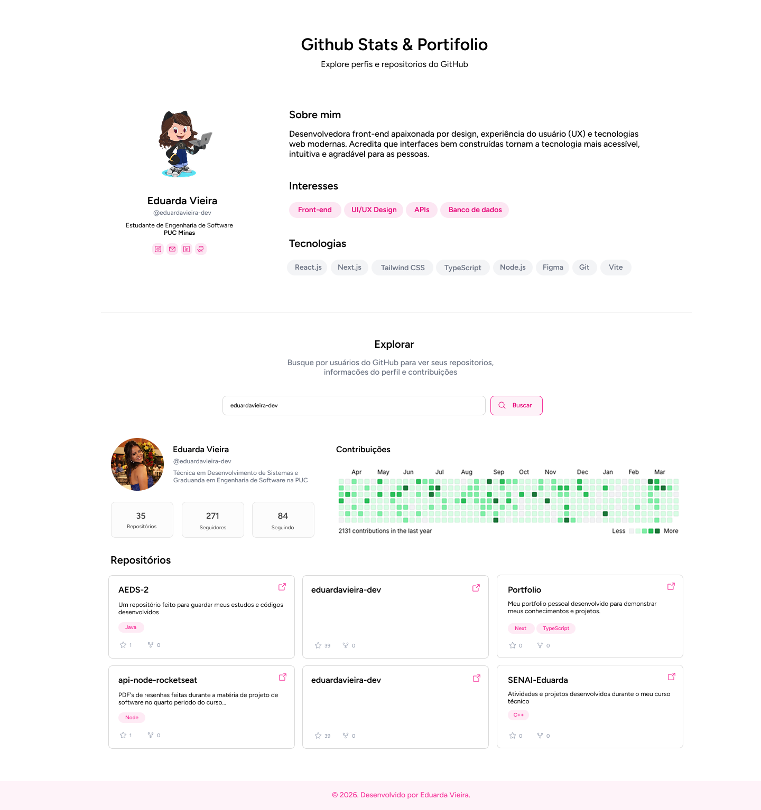

# Github Stats & Portfólio

Explore perfis, repositórios e contribuições do GitHub em uma interface moderna e responsiva.



## Visão Geral

Este projeto é um portfólio interativo que permite buscar qualquer usuário do GitHub e visualizar:

- Perfil completo (avatar, bio, descrição)
- Contribuições públicas (heatmap)
- Repositórios públicos com detalhes (nome, descrição, linguagem, estrelas, forks)
- Métricas de seguidores, seguindo e total de repositórios

Ideal para desenvolvedores que querem apresentar suas habilidades, stack e engajamento real na comunidade open source.

## Funcionalidades

- Busca dinâmica de usuários do GitHub
- Exibição de perfil detalhado
- Visualização de contribuições (GitHub contributions calendar)
- Listagem de repositórios com filtros e destaques
- Seção de interesses e tecnologias
- Layout responsivo e acessível
- Design limpo, com foco em usabilidade

## Tecnologias Utilizadas

- React
- TypeScript
- Vite
- Tailwind CSS
- GitHub REST API

## Estrutura do Projeto

```text
src/
	App.tsx        # Página principal
	App.css        # Estilos globais e variáveis
	main.tsx       # Bootstrap da aplicação
public/          # Assets estáticos (imagens, favicon, etc)
```

## Como Executar

### Pré-requisitos
- Node.js 18+
- npm, yarn ou pnpm

### Instalação
```bash
npm install
```

### Ambiente de desenvolvimento
```bash
npm run dev
```

### Build de produção
```bash
npm run build
```

### Pré-visualização do build
```bash
npm run preview
```

## Exemplo de Uso da API

Para buscar um usuário:
```js
fetch('https://api.github.com/users/SEU_USUARIO')
	.then(res => res.json())
	.then(data => console.log(data))
```

Para listar repositórios:
```js
fetch('https://api.github.com/users/SEU_USUARIO/repos')
	.then(res => res.json())
	.then(repos => console.log(repos))
```

---

### Sobre o Tailwind CSS

Tailwind CSS é um framework utilitário para estilização rápida e moderna de interfaces. Ele permite criar layouts responsivos e customizados usando classes diretamente no HTML/JSX, sem a necessidade de escrever CSS tradicional para cada componente.

- Saiba mais: [tailwindcss.com](https://tailwindcss.com/)

---

### Sobre a API do GitHub

A aplicação utiliza a [GitHub REST API](https://docs.github.com/pt/rest/users/users#get-a-user) para buscar informações de usuários, repositórios e contribuições públicas. Veja como consultar um usuário na documentação oficial:

- Buscar usuário: [docs.github.com/pt/rest/users/users#get-a-user](https://docs.github.com/pt/rest/users/users#get-a-user)


## Roadmap Sugerido

- [x] Busca de usuários do GitHub
- [x] Exibição de perfil e repositórios
- [x] Métricas e heatmap de contribuições
- [ ] Filtros avançados de repositórios
- [ ] Deploy automático (Vercel/Netlify)

## Licença

Projeto livre para uso, estudo e personalização.
